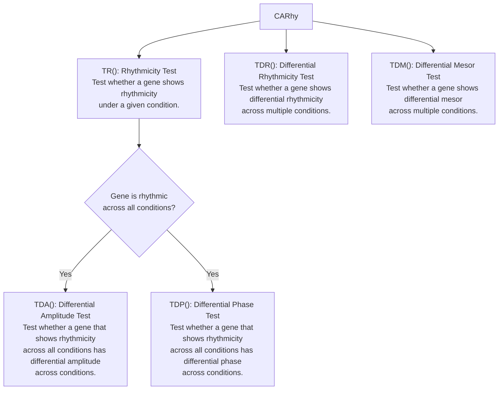

# CARhy

<!-- badges: start -->
<!-- badges: end -->

**CARhy** (*Comprehensive Analyses of Circadian Rhythms*) is an R package for analyzing circadian rhythms in transcriptomic experiments with multiple experimental conditions. It provides functions for rhythmicity testing, differential rhythmicity testing, differential mesor/amplitude/phase testing, rhythm-parameter estimation, and multiple-testing correction.

## Features

- Test rhythmicity within a single condition.
- Test differential rhythmicity across multiple conditions.
- Test differential rhythm amplitude, phase, and mesor across multiple conditions.
- Estimate mesor, amplitude, phase, standard errors, and confidence intervals.
- Supports balanced designs, unevenly spaced sampling times, unequal numbers of replicates, and missing values.
- Reports raw p-values, Benjamini-Hochberg adjusted p-values, and Storey q-values.
- Optional RNA-seq count preprocessing using low-expression filtering and TMM normalization via **edgeR**.

## Installation

```r
install.packages("remotes")
remotes::install_github("DrHuang123/Comprehensive-Analyses-of-Circadian-Rhythms-CARhy")
```

## Optional packages

If you would like to use Storey q-value estimation, install the **qvalue** package:

```r
if (!requireNamespace("BiocManager", quietly = TRUE)) {
  install.packages("BiocManager")
}
BiocManager::install("qvalue")
```

If you would like to use the optional RNA-seq count preprocessing workflow in `preprocess_counts()`, install **edgeR**:

```r
if (!requireNamespace("BiocManager", quietly = TRUE)) {
  install.packages("BiocManager")
}
BiocManager::install("edgeR")
```

## Overview

The logic diagram of CARhy is shown below.



## Main functions

| Function | Purpose | Main input | Output |
| --- | --- | --- | --- |
| `TR()` | Test rhythmicity within one condition | Gene-by-sample expression matrix and sampling times | `pvalue`, `BH`, `qvalue` |
| `TDR()` | Test whether rhythmicity differs across multiple conditions | List of expression matrices and time vectors | `pvalue`, `BH`, `qvalue` |
| `TDA()` | Test whether rhythm amplitude differs across multiple conditions | List of expression matrices and time vectors | `pvalue`, `BH`, `qvalue` |
| `TDP()` | Test whether rhythm phase differs across multiple conditions | List of expression matrices and time vectors | `pvalue`, `BH`, `qvalue` |
| `TDM()` | Test whether mesor differs across multiple conditions | List of expression matrices and time vectors | `pvalue`, `BH`, `qvalue` |
| `preprocess_counts()` | Preprocess RNA-seq count data before rhythm analysis | Raw count matrix | Normalized expression matrix or `edgeR::DGEList` |
| `params_output()` | Output rhythm parameters | Expression matrix and sampling times | Mesor, amplitude, phase, and confidence intervals |

## Documentation

For more details about each function, see the corresponding help page in R:

```r
?TR
?TDR
?TDA
?TDP
?TDM
?preprocess_counts
?params_output
```

````markdown
## Citation

If you use CARhy, please cite:

```bibtex
@article{huang2026carhy,
  title={CARhy: Comprehensive Analyses of Circadian Rhythms in Transcriptomic Experiments with Multiple Conditions},
  author={Huang, W. and Menet, J. S. and Sinha, S.},
  journal={arXiv preprint arXiv:2604.26765},
  year={2026}
}

## License

This package is released under the MIT license. See `LICENSE` for details.
